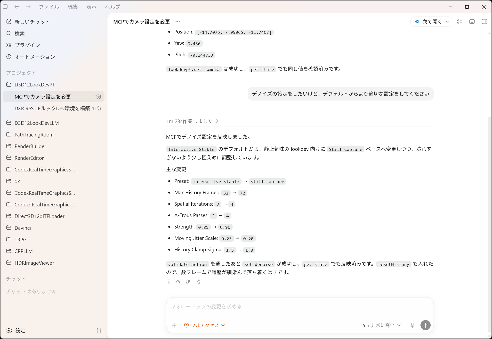

# MCP Server

D3D12LookDevPT includes a local MCP server for inspecting and controlling the running renderer from tools such as VS Code, Codex, or custom JSON-RPC clients. The server exposes the same validation-oriented action layer used by the ImGui UI.

Japanese documentation: [MCP サーバー](mcp.ja.md)

## MCP-Driven Workflow Example

The screenshots below show a typical local workflow: an MCP-capable client issues natural-language camera and denoise requests, and D3D12LookDevPT applies them through `lookdevpt.set_camera`, `lookdevpt.set_denoise`, and `lookdevpt.get_state`.


The viewport above is the renderer with the MCP server running, recent local JSON-RPC requests listed, and the bearer token area redacted. Do not commit real MCP tokens in screenshots or project files.



The client can validate settings first, apply mutation tools, then read state back to confirm that the renderer accepted the same values.

## Availability And Security

- Endpoint: `http://127.0.0.1:<port>/mcp`
- Default port: `8777`
- Bind address: `127.0.0.1` only
- Transport: Streamable HTTP-style JSON-RPC over `POST /mcp`
- Protocol versions accepted: `2025-11-25`, `2025-06-18`
- Authentication: `Authorization: Bearer <token>` is required
- Session: `initialize` returns `MCP-Session-Id`; all later requests must send it
- Server-Sent Events: not implemented; `GET /mcp` returns `405 Method Not Allowed`

The bearer token and MCP settings are stored in:

```text
%APPDATA%\D3D12LookDevPT\settings.json
```

This file is user-local. Do not copy the token into `.lookdevpt.json`, README files, screenshots, issue comments, or committed VS Code settings.

The server accepts browser/client `Origin` values only when absent, `null`, `http://127.0.0.1:*`, or `http://localhost:*`. Other origins are rejected with `403`.

## Starting The Server

Use the dockable `MCP Server` panel:

- `Start Server` / `Stop Server`
- `Port`
- `Request Timeout`
- `Access Mode`
- `Copy Token`
- `Regenerate Token`
- pending approvals and recent request log

The server is disabled by default. It can also be started from the command line:

```powershell
.\Bin\x64\Debug\D3D12LookDevPT.exe --mcp-server --mcp-port 8777 --mcp-token <token> --mcp-access confirm_mutations
```

Access modes:

- `read_only`: read tools work; mutation tools are rejected.
- `confirm_mutations`: mutation tools wait for approval in the ImGui `MCP Server` panel.
- `allow_mutations`: mutation tools execute without UI approval.

The mutation queue is processed on the main thread and has a limit of 16 queued requests. Mutations never touch D3D12 or ImGui state directly from the HTTP server thread.

## VS Code Configuration

VS Code stores MCP server configuration in `mcp.json`, either in `.vscode/mcp.json` or in the user profile. VS Code's current MCP configuration reference uses `type`, `url`, and `headers` for HTTP servers, with optional `inputs` for secrets.

Example `.vscode/mcp.json`:

```json
{
  "inputs": [
    {
      "type": "promptString",
      "id": "lookdevpt-token",
      "description": "D3D12LookDevPT MCP bearer token",
      "password": true
    }
  ],
  "servers": {
    "d3d12LookDevPT": {
      "type": "http",
      "url": "http://127.0.0.1:8777/mcp",
      "headers": {
        "Authorization": "Bearer ${input:lookdevpt-token}",
        "MCP-Protocol-Version": "2025-11-25"
      }
    }
  }
}
```

Use `MCP: List Servers` to start or restart the server entry after editing the file. Use `MCP: Reset Cached Tools` if the tool list changes after rebuilding D3D12LookDevPT.

Notes:

- Start D3D12LookDevPT and its MCP server before starting the VS Code MCP entry.
- If the token is regenerated in ImGui, restart the VS Code MCP server entry and enter the new token.
- This server supports HTTP POST JSON-RPC. Clients that require SSE-only MCP will not work.

## JSON-RPC Flow

Every client should initialize first, keep the returned session id, then send `notifications/initialized`.

PowerShell example:

```powershell
$endpoint = "http://127.0.0.1:8777/mcp"
$token = "<token>"
$headers = @{
  "Authorization" = "Bearer $token"
  "MCP-Protocol-Version" = "2025-11-25"
}

$initBody = @{
  jsonrpc = "2.0"
  id = 1
  method = "initialize"
  params = @{
    protocolVersion = "2025-11-25"
    capabilities = @{}
    clientInfo = @{ name = "manual-client"; version = "1.0" }
  }
} | ConvertTo-Json -Depth 10 -Compress

$init = Invoke-WebRequest -Uri $endpoint -Method Post -Headers $headers -ContentType "application/json" -Body $initBody
$sessionId = [string]$init.Headers["MCP-Session-Id"][0]

$sessionHeaders = @{
  "Authorization" = "Bearer $token"
  "MCP-Protocol-Version" = "2025-11-25"
  "MCP-Session-Id" = $sessionId
}

$initialized = @{
  jsonrpc = "2.0"
  method = "notifications/initialized"
  params = @{}
} | ConvertTo-Json -Depth 10 -Compress

Invoke-WebRequest -Uri $endpoint -Method Post -Headers $sessionHeaders -ContentType "application/json" -Body $initialized
```

Call a read tool:

```powershell
$body = @{
  jsonrpc = "2.0"
  id = 2
  method = "tools/call"
  params = @{
    name = "lookdevpt.get_state"
    arguments = @{}
  }
} | ConvertTo-Json -Depth 10 -Compress

Invoke-WebRequest -Uri $endpoint -Method Post -Headers $sessionHeaders -ContentType "application/json" -Body $body
```

End a session:

```powershell
Invoke-WebRequest -Uri $endpoint -Method Delete -Headers $sessionHeaders
```

## Tools

Read tools:

- `lookdevpt.get_stats`: returns adapter, DXR tier, resolution, scene counts, accumulated samples, active mode, reservoir count, denoiser status, and MCP queue state.
- `lookdevpt.get_state`: returns scene path, project path, camera, lighting, path tracing, ReSTIR, denoise, and view state.
- `lookdevpt.list_materials`: returns material names, usage counts, editable PBR factors, and texture slot state.
- `lookdevpt.list_debug_views`: returns debug view ids, labels, and keys.
- `lookdevpt.list_render_modes`: returns render mode labels and action values.
- `lookdevpt.get_diagnostics`: returns scene/project/capture/MCP diagnostics.
- `lookdevpt.capture_viewport`: captures the current final/debug viewport as PNG and returns an inline `image/png` plus `lookdevpt://captures/latest.png`.
- `lookdevpt.capture_debug_pack`: captures up to eight debug views and returns resource links for each PNG.

Validation:

- `lookdevpt.validate_action`: accepts `{ "method": "...", "params": { ... } }` and runs the same action path with `validateOnly=true`.
- `lookdevpt.run_actions`: validates and applies multiple action-layer calls as one MCP request. Validation failure prevents all mutation.

Mutation tools:

- `lookdevpt.reset_accumulation`
- `lookdevpt.reset_denoise_history`
- `lookdevpt.reset_reservoirs`
- `lookdevpt.reset_camera_view`
- `lookdevpt.set_camera_speed`
- `lookdevpt.fit_camera_to_scene`
- `lookdevpt.set_display_resolution`
- `lookdevpt.load_project`
- `lookdevpt.save_project`
- `lookdevpt.save_project_as`
- `lookdevpt.set_scene`
- `lookdevpt.set_camera`
- `lookdevpt.set_material`
- `lookdevpt.set_material_texture`
- `lookdevpt.reset_material`
- `lookdevpt.save_material_variant`
- `lookdevpt.apply_material_variant`
- `lookdevpt.delete_material_variant`
- `lookdevpt.set_material_view`
- `lookdevpt.set_color_management`
- `lookdevpt.set_lighting`
- `lookdevpt.set_path_tracing`
- `lookdevpt.set_restir`
- `lookdevpt.set_denoise`
- `lookdevpt.set_view`

Tool results primarily use `structuredContent`. A text content summary is also included for compatibility.

## Resources

- `lookdevpt://state`: current state JSON.
- `lookdevpt://stats`: current stats JSON.
- `lookdevpt://diagnostics`: scene, project, capture, and MCP diagnostics.
- `lookdevpt://materials`: material list JSON.
- `lookdevpt://materials/{index}`: one material object.
- `lookdevpt://materials/{index}/textures`: source/current/override texture slots for one material.
- `lookdevpt://material-variants`: saved per-material variant snapshots.
- `lookdevpt://material-presets`: built-in and user material presets.
- `lookdevpt://debug-views`: debug view ids, labels, and keys.
- `lookdevpt://render-modes`: render modes and `set_path_tracing.mode` values.
- `lookdevpt://project`: current project path and dirty flag.
- `lookdevpt://scene/summary`: scene counts, bounds, lights, and asset paths.
- `lookdevpt://actions/schema`: action names and JSON input schemas.
- `lookdevpt://captures/index`: in-memory capture history.
- `lookdevpt://captures/latest.png`: most recent PNG capture.
- `lookdevpt://captures/{id}.png`: PNG from `capture_viewport` or `capture_debug_pack`.

Resource templates:

- `lookdevpt://captures/{id}.png`
- `lookdevpt://materials/{index}`
- `lookdevpt://materials/{index}/textures`

Prompts:

- `lookdevpt.inspect_scene`: read state/stats/materials/diagnostics and summarize the scene.
- `lookdevpt.tune_denoise`: propose and apply stable denoise settings through validation.
- `lookdevpt.setup_camera_shot`: fit/refine a camera shot using scene bounds and state.
- `lookdevpt.capture_debug_review`: capture a debug pack and summarize visible issues.

Example resource read:

```json
{
  "jsonrpc": "2.0",
  "id": 3,
  "method": "resources/read",
  "params": {
    "uri": "lookdevpt://actions/schema"
  }
}
```

## Common Operations

Get camera:

```json
{
  "jsonrpc": "2.0",
  "id": 10,
  "method": "tools/call",
  "params": {
    "name": "lookdevpt.get_state",
    "arguments": {}
  }
}
```

Set camera:

```json
{
  "jsonrpc": "2.0",
  "id": 11,
  "method": "tools/call",
  "params": {
    "name": "lookdevpt.set_camera",
    "arguments": {
      "position": [-14.7075, 7.99065, -11.7407],
      "yaw": 0.456,
      "pitch": -0.144733
    }
  }
}
```

Load Bistro:

```json
{
  "jsonrpc": "2.0",
  "id": 12,
  "method": "tools/call",
  "params": {
    "name": "lookdevpt.set_scene",
    "arguments": {
      "scenePath": "D:\\Git\\D3D12LookDevPT\\Bistro_v5_2\\BistroExterior.fbx"
    }
  }
}
```

Set ReSTIR GI + DI:

```json
{
  "jsonrpc": "2.0",
  "id": 13,
  "method": "tools/call",
  "params": {
    "name": "lookdevpt.set_path_tracing",
    "arguments": {
      "mode": "restir_gi_di",
      "samplesPerFrame": 2,
      "maxBounces": 4,
      "radianceClamp": 8.0
    }
  }
}
```

Set the interactive denoise preset:

```json
{
  "jsonrpc": "2.0",
  "id": 14,
  "method": "tools/call",
  "params": {
    "name": "lookdevpt.set_denoise",
    "arguments": {
      "preset": "interactive_stable",
      "temporalStability": true,
      "jitterMode": "stable16",
      "movingJitterScale": 0.25,
      "resetHistory": true
    }
  }
}
```

Select DLSS Ray Reconstruction when available. Unsupported machines keep the selected backend but fall back to the internal denoiser; read `denoise.dlss.fallbackReason` from `lookdevpt.get_state` for details. More setup notes are in [Optional DLSS Ray Reconstruction](dlss.md).

```json
{
  "jsonrpc": "2.0",
  "id": 15,
  "method": "tools/call",
  "params": {
    "name": "lookdevpt.set_denoise",
    "arguments": {
      "backend": "dlss_rr",
      "dlssMode": "quality",
      "resetDlss": true
    }
  }
}
```

Set material factors:

```json
{
  "jsonrpc": "2.0",
  "id": 16,
  "method": "tools/call",
  "params": {
    "name": "lookdevpt.set_material",
    "arguments": {
      "index": 0,
      "baseColor": [0.9, 0.76, 0.54, 1.0],
      "roughness": 0.42,
      "metallic": 0.0
    }
  }
}
```

Override or clear a material texture slot:

```json
{
  "jsonrpc": "2.0",
  "id": 16,
  "method": "tools/call",
  "params": {
    "name": "lookdevpt.set_material_texture",
    "arguments": {
      "index": 0,
      "slot": "baseColor",
      "path": "D:\\LookDevTextures\\paint_basecolor.png"
    }
  }
}
```

Use `"clear": true` to remove the slot override, or `"resetToSource": true` to restore the imported source texture for that slot.

Save and apply a material variant:

```json
{
  "jsonrpc": "2.0",
  "id": 17,
  "method": "tools/call",
  "params": {
    "name": "lookdevpt.save_material_variant",
    "arguments": {
      "index": 0,
      "variant": "warm rough"
    }
  }
}
```

```json
{
  "jsonrpc": "2.0",
  "id": 18,
  "method": "tools/call",
  "params": {
    "name": "lookdevpt.apply_material_variant",
    "arguments": {
      "index": 0,
      "variant": "warm rough"
    }
  }
}
```

Focus one material and adjust the final view transform:

```json
{
  "jsonrpc": "2.0",
  "id": 19,
  "method": "tools/call",
  "params": {
    "name": "lookdevpt.run_actions",
    "arguments": {
      "actions": [
        {
          "method": "set_material_view",
          "params": { "selectedMaterial": 0, "focusMode": "dim" }
        },
        {
          "method": "set_color_management",
          "params": { "toneMapper": "aces", "exposure": 0.0, "gamma": 2.2 }
        }
      ],
      "validateOnly": false,
      "stopOnError": true
    }
  }
}
```

Capture the viewport:

```json
{
  "jsonrpc": "2.0",
  "id": 20,
  "method": "tools/call",
  "params": {
    "name": "lookdevpt.capture_viewport",
    "arguments": {}
  }
}
```

Run a validated batch:

```json
{
  "jsonrpc": "2.0",
  "id": 21,
  "method": "tools/call",
  "params": {
    "name": "lookdevpt.run_actions",
    "arguments": {
      "actions": [
        {
          "method": "set_path_tracing",
          "params": { "mode": "restir_gi_di", "samplesPerFrame": 2 }
        },
        {
          "method": "set_denoise",
          "params": { "preset": "interactive_stable", "resetHistory": true }
        }
      ],
      "validateOnly": false,
      "stopOnError": true
    }
  }
}
```

Capture a debug review pack:

```json
{
  "jsonrpc": "2.0",
  "id": 22,
  "method": "tools/call",
  "params": {
    "name": "lookdevpt.capture_debug_pack",
    "arguments": {
      "views": [
        "Final",
        "Base Color",
        "World Normal",
        "Roughness",
        "Metallic",
        "Direct Signal",
        "Indirect Signal",
        "History Confidence"
      ]
    }
  }
}
```

Save a project without a dialog:

```json
{
  "jsonrpc": "2.0",
  "id": 23,
  "method": "tools/call",
  "params": {
    "name": "lookdevpt.save_project_as",
    "arguments": {
      "path": "D:\\Git\\D3D12LookDevPT\\projects\\bistro.lookdevpt.json"
    }
  }
}
```

## Troubleshooting

- `401 Unauthorized`: token mismatch. Copy the token from the ImGui `MCP Server` panel and restart the client connection.
- `403 Forbidden`: client sent a disallowed `Origin` header.
- `400 Unsupported MCP-Protocol-Version`: use `2025-11-25` or `2025-06-18`.
- `400 MCP-Session-Id is required`: call `initialize` first, then send the returned `MCP-Session-Id`.
- `404 Unknown MCP session`: the session was deleted or the app/server restarted. Initialize again.
- `405 Method Not Allowed` on `GET`: expected; this server does not implement SSE.
- Mutation request hangs in `confirm_mutations`: approve or reject it in the ImGui `MCP Server` panel before the request timeout.
- `MCP mutation queue is full`: wait for pending requests to finish, approve/reject pending mutations, or restart the server.
- `lookdevpt://captures/latest.png` fails: call `lookdevpt.capture_viewport` once before reading the resource.

## References

- [MCP lifecycle 2025-11-25](https://modelcontextprotocol.io/specification/2025-11-25/basic/lifecycle)
- [VS Code MCP configuration reference](https://code.visualstudio.com/docs/agents/reference/mcp-configuration)
